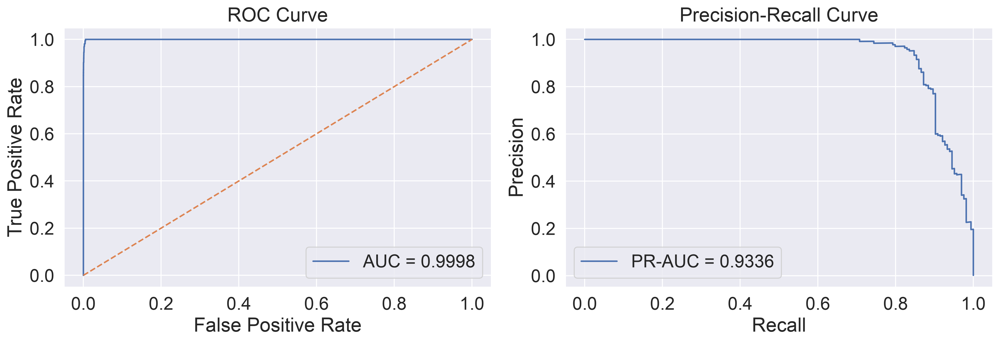
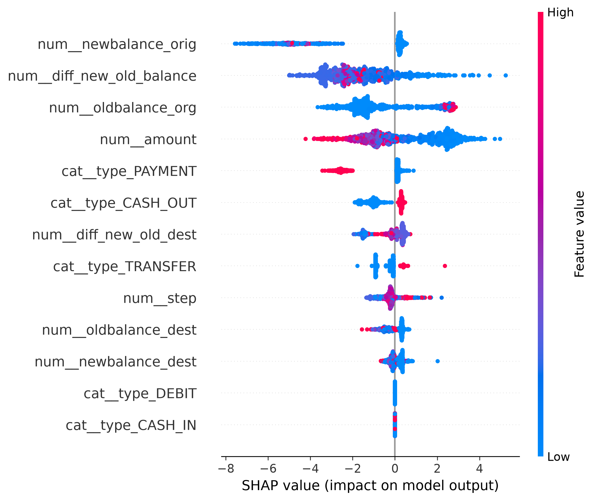
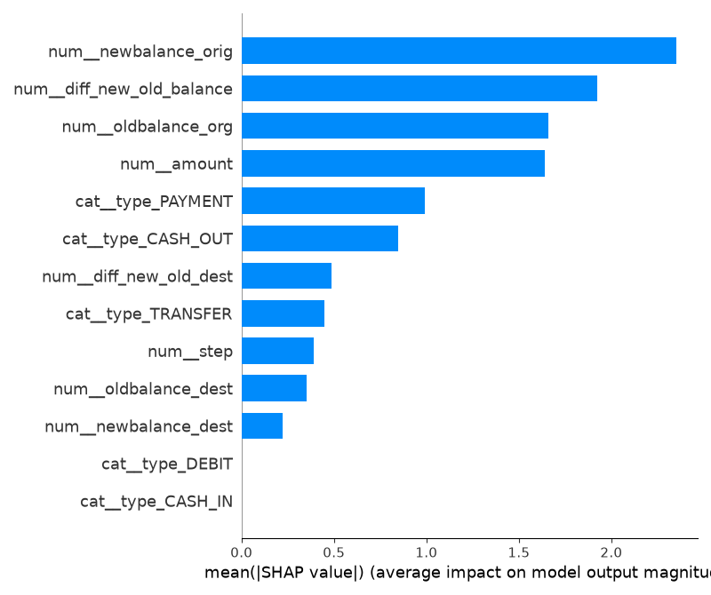
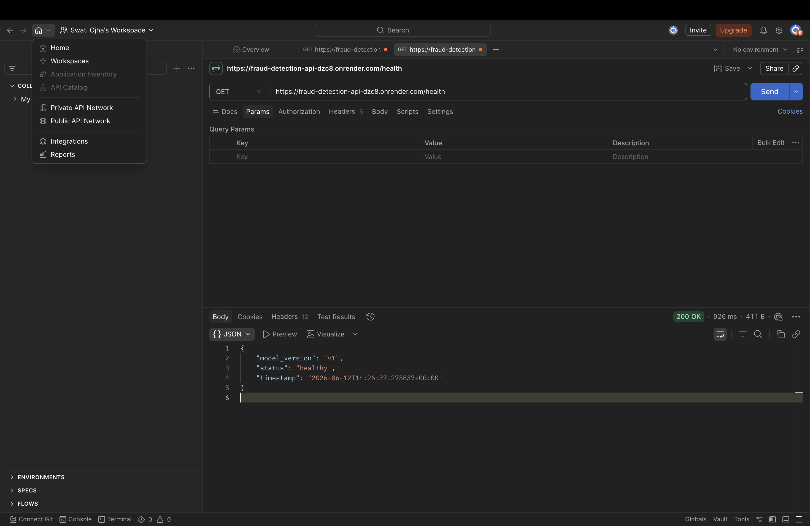
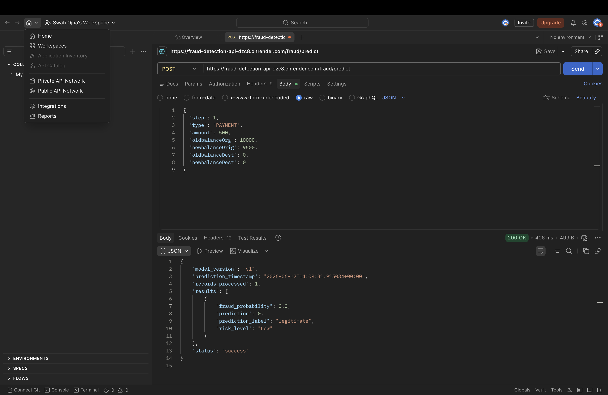
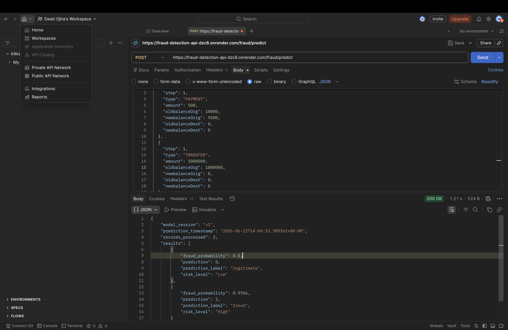
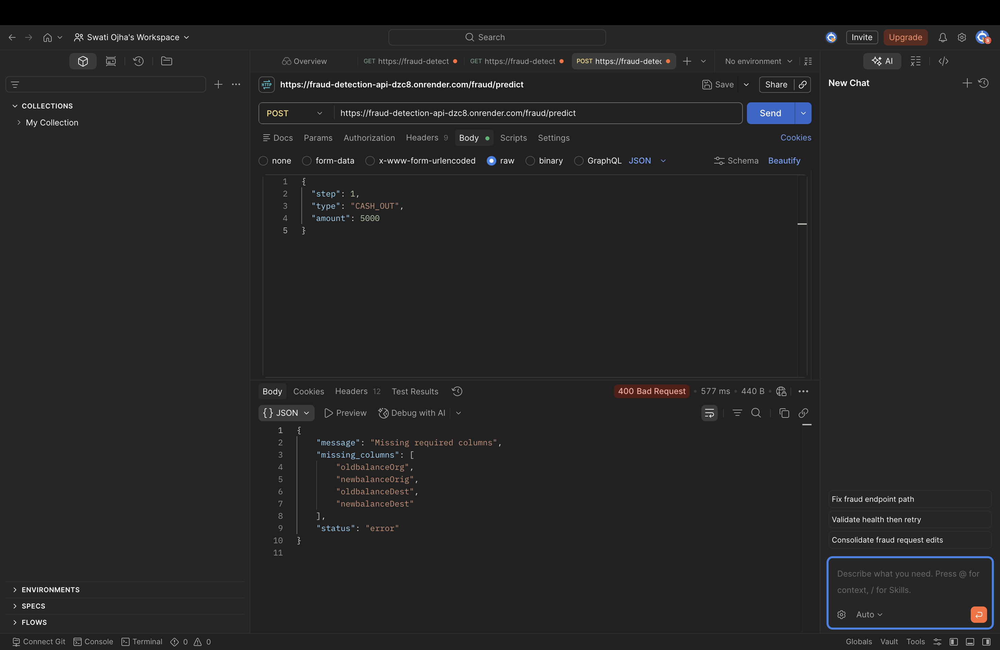

# Transaction Fraud Detection System
A machine learning project that detects whether a financial transaction is fraudulent or legitimate using XGBoost + Feature Engineering + Flask API + SHAP Explainability.The system is deployed and ready for real-world use via a REST API.

## Live System Features
* Fraud prediction using trained ML pipeline (XGBoost)
* Feature engineering + preprocessing pipeline included
* REST API built with Flask
* Batch prediction support
* Model explainability using SHAP
* Deployed on production (Render)
* Handles missing/invalid input gracefully

## Business Problem
Financial fraud causes huge losses to banks and customers.The goal is to detect fraudulent transactions early and reduce financial damage while maintaining low false alarms.
The system is designed to help a fraud detection company maximize revenue by correctly identifying fraudulent transactions.

## Solution Approach
1. Data cleaning and preprocessing
2. Feature engineering (balance differences, transaction behavior patterns)
3. Exploratory Data Analysis (EDA)
4. Model training (Logistic Regression, Random Forest, XGBoost, etc.)
5. Hyperparameter tuning
6. Model evaluation using Precision, Recall, F1-score, ROC-AUC
7. Explainability using SHAP
8. Deployment using Flask + Render

## Model Performance
XGBoost was selected as the final model.

#### Metric	Score
ROC-AUC 0.9998 
PR-AUC 0.9326 
Balanced Accuracy	0.93
Precision	0.892
Recall	0.860
F1 Score	0.876

#### Model Comparison
Model	F1 Score
Logistic Regression	Low
Random Forest	High
XGBoost (Final Model)	Best

## Model Evaluation Curves
ROC and Precision-Recall curves were used to evaluate model performance on unseen data.

#### ROC Curve and Precision-Recall Curve(combined)
<div align="center">
  
</div>

## Model Explainability (SHAP)
#### SHAP Summary Plot
<div align="center">
  
</div>

#### SHAP Feature Importance
<div align="center">
  
</div>

SHAP helps understand:
* Which features influence fraud detection
* How each transaction is classified
* Model transparency for real-world usage

## API Endpoints
#### Health Check
GET /health

#### Single Prediction
POST /fraud/predict
Example request:
{
  "step": 1,
  "type": "CASH_OUT",
  "amount": 5000,
  "oldbalanceOrg": 10000,
  "newbalanceOrig": 5000,
  "oldbalanceDest": 0,
  "newbalanceDest": 5000
}
Example response:
{
  "prediction": 1,
  "fraud_probability": 0.87,
  "risk_level": "High"
}

#### Batch Prediction
POST /fraud/predict
* Accepts multiple transactions
* Returns prediction list with risk levels

## Docker
#### Build Docker Image

```bash
docker build -t fraud-detection-api .
```
### Run Docker Container

```bash
docker run -p 5001:5000 fraud-detection-api
```
The API will be available at:

```text
http://localhost:5001
```

#### Health Check

```bash
curl http://localhost:5001/health
```
Example response:

```json
{
  "status": "healthy",
  "model_version": "v1"
}
```

### Fraud Prediction

```bash
curl -X POST http://localhost:5001/fraud/predict \
-H "Content-Type: application/json" \
-d '{
    "step": 1,
    "type": "TRANSFER",
    "amount": 10000,
    "oldbalanceOrg": 20000,
    "newbalanceOrig": 10000,
    "oldbalanceDest": 0,
    "newbalanceDest": 10000
}'
```
Example response:

```json
{
  "status": "success",
  "results": [
    {
      "prediction": 0,
      "prediction_label": "legitimate",
      "fraud_probability": 0.0001,
      "risk_level": "Low"
    }
  ]
}
```

## API Testing Screenshots
#### GET Health Check

#### Single Prediction

#### Batch Prediction

#### Missing Columns Handling


## Tech Stack

#### Machine Learning & Data Science
* Python
* Pandas
* NumPy
* Scikit-learn
* XGBoost
* SHAP (Model Explainability)
* Joblib

#### Backend Development
* Flask (REST API)
* RESTful API Design
* JSON-based request/response handling

#### Frontend / Dashboard
* Streamlit
* Interactive Data Visualization

#### Deployment & DevOps
* Docker
* Docker Compose
* Render (Cloud Deployment)

#### Visualization & Analysis
* Matplotlib
* Seaborn (if used)

## Interactive Dashboard

The project includes a Streamlit dashboard for real-time fraud analysis.

### Dashboard Pages

#### Home
- Project overview
- System architecture
- Feature engineering pipeline
- Technology stack

#### Single Prediction
Predict fraud risk for an individual transaction.

#### Batch Prediction
Upload a CSV file and score multiple transactions at once.

#### Analytics Dashboard
- Fraud rate analysis
- Risk level distribution
- Transaction type analysis
- Fraud probability trends
- High-risk transaction reporting

### Run Dashboard

```bash
streamlit run streamlit_app/app.py
```

## Project Structure

Transaction Fraud Detection System

api/
    app.py

fraud/
    __init__.py
    fraud_model.py

artifacts/
    xgboost_fraud_detector.joblib

data/
    raw/

streamlit_app/
    app.py
    pages/
        single_prediction.py
        batch_prediction.py
        analytics.py
    utils/
        api_client.py

notebooks/
    EDA.ipynb
    model_training.ipynb
    shap_analysis.ipynb

tests/
    test_api.py
    test_model_inference.py

reports/
    figures/
    screenshots/

Dockerfile
Dockerfile.streamlit
docker-compose.yml
Procfile
runtime.txt
requirements.txt
README.md

## Key Learnings
* Handling highly imbalanced datasets
* Feature engineering improves model performance significantly
* XGBoost performs best for tabular fraud data
* Model interpretability is important for real-world ML systems

## Future Improvements
* Implement real-time streaming predictions
* Add monitoring for model drift
* Improve API security (authentication layer)

## License
This project is licensed under the MIT License.
